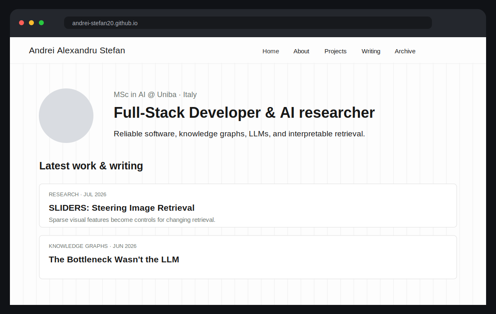
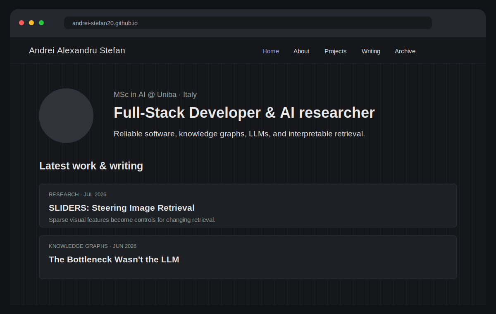
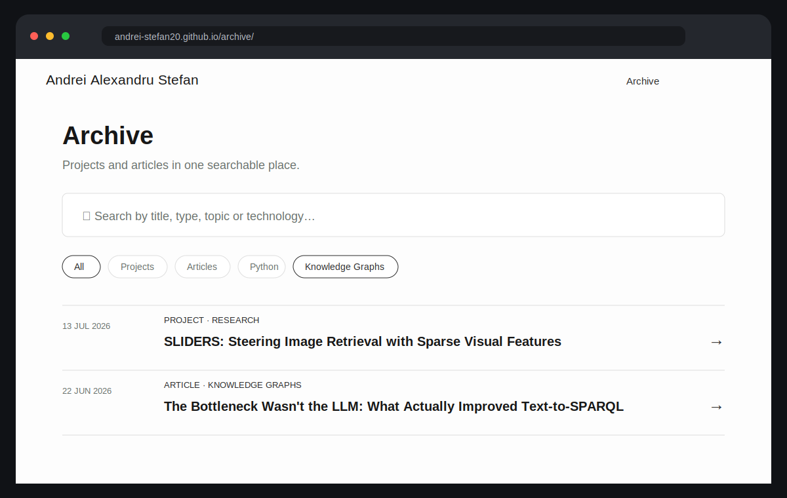

<div align="center">

# Andrei Alexandru Stefan — Portfolio

**A bilingual portfolio for AI research, software engineering, projects, and technical writing.**

[](https://andrei-stefan20.github.io/)
[](https://jekyllrb.com/)
[](https://pages.github.com/)
[](https://andrei-stefan20.github.io/)

<br>



</div>

## Overview

This repository contains the source code of my personal portfolio. It is designed to present **research projects, software work, and technical articles** in a clean interface that stays readable on desktop and mobile.

The site is intentionally lightweight: Jekyll generates the pages, GitHub Actions builds the search index, and GitHub Pages publishes the result.

### What makes it different

- **Projects and articles share one content system** while keeping their own layouts.
- **English and Italian versions** are linked through shared slugs.
- **Archive search and filters** make projects, articles, topics, and technologies easy to browse.
- **Automatic light/dark mode** follows the browser on first visit and remembers manual choices.
- **Configurable visual style** includes grid, dots, or plain backgrounds and an optional handwritten font.
- **No heavy frontend framework** is required.

## Interface

<table>
<tr>
<td width="50%">

</td>
<td width="50%">

</td>
</tr>
<tr>
<td align="center"><strong>Light mode</strong></td>
<td align="center"><strong>Dark mode</strong></td>
</tr>
</table>



The archive combines all published content in one place and supports filtering by content type, category, tag, and technology.

## Current content

The portfolio currently highlights work around:

- interpretable image retrieval with DINOv2, sparse autoencoders, and FAISS;
- Text-to-SPARQL generation over Wikidata;
- knowledge graphs and large language models;
- deep learning and model distillation;
- full-stack software and AI-powered systems.

## Technology stack

| Layer | Technology |
|---|---|
| Static site | Jekyll, Liquid, Markdown |
| Styling | Custom CSS, responsive grid layouts |
| Interactions | Vanilla JavaScript |
| Search | Pagefind |
| Deployment | GitHub Actions and GitHub Pages |
| Comments | Optional Giscus integration |
| Localisation | YAML locale files and language-aware content |

## Content structure

```text
entries/
├── projects/
│   └── project-slug/
│       ├── en.md
│       └── it.md
└── articles/
    └── article-slug/
        ├── en.md
        └── it.md

images/
├── projects/
└── articles/
```

Each project or article has its own folder. Translations stay together and share the same `slug`, allowing the language switcher to find the matching page automatically.

## Adding a project

Create a new folder under `entries/projects/` and add one Markdown file for each language.

```yaml
---
title: "Project title"
type: project
layout: case-study
lang: en
slug: project-slug
permalink: /entries/project-slug/
date: 2026-01-15
year: 2026
image: "/images/projects/project-slug/cover.png"
thumbnail: "/images/projects/project-slug/thumbnail.png"
cover: "/images/projects/project-slug/cover.png"
role: "Machine Learning Engineering"
technologies: [Python, PyTorch, FAISS]
code: "https://github.com/username/project"
demo: ""
paper: ""
excerpt: "A concise summary shown in project lists and previews."
---
```

## Adding an article

Create the article under `entries/articles/`.

```yaml
---
title: "Article title"
type: article
layout: article
lang: en
slug: article-slug
permalink: /entries/article-slug/
date: 2026-01-15
category: "Artificial Intelligence"
read_time: 8
image: "/images/articles/article-slug/cover.png"
thumbnail: "/images/articles/article-slug/thumbnail.png"
cover: "/images/articles/article-slug/cover.png"
excerpt: "A short abstract used in lists and social previews."
---
```

## Appearance configuration

Most visual options are controlled from `config.yml`.

```yaml
appearance:
  accent_color: "#2b2b2b"
  recent_items_on_home: 5
  background_pattern: "grid"
  theme_mode: "auto"
  font_style: "default"
```

Available background values are `none`, `grid`, and `dots`. The automatic theme uses the browser preference on the first visit and stores later manual choices.

## Local development

```bash
bundle install
bundle exec jekyll serve --config config.yml
```

Open `http://localhost:4000`.

To test the production search index locally:

```bash
bundle exec jekyll build --config config.yml
npx pagefind --site _site
cd _site && python3 -m http.server 4000
```

## Deployment

Every push to `main` triggers the GitHub Actions workflow:

```text
Jekyll build
   ↓
Pagefind index
   ↓
GitHub Pages artifact
   ↓
Deployment
```

The live version is available at **[andrei-stefan20.github.io](https://andrei-stefan20.github.io/)**.

## Main repository areas

| Purpose | Path |
|---|---|
| Site configuration | `config.yml` |
| Localised text | `data/locales/` |
| Projects | `entries/projects/` |
| Articles | `entries/articles/` |
| Reusable components | `includes/` |
| Page layouts | `layouts/` |
| Styling | `css/` |
| Client-side behaviour | `js/` |
| GitHub Pages workflow | `.github/workflows/pages.yml` |

## License

MIT. See [`LICENSE`](LICENSE).
